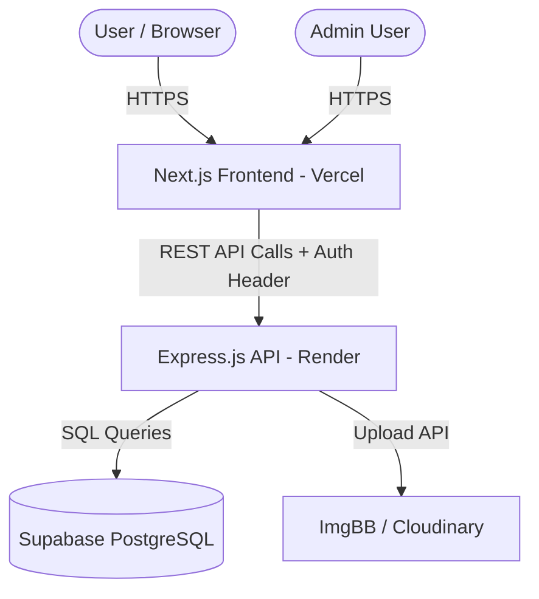

# System Architecture & Design Document

This document defines the system design, tech stack selection, data structures, and security layers governing the **AgeSense Initiative** platform.

---

## 1. System Overview

AgeSense is structured as a decoupled, client-server architecture containing a Next.js frontend application and an Express.js API backend.



---

## 2. Tech Stack Specification

### Frontend
- **Framework**: Next.js 16 (App Router structure)
- **Runtime & Language**: Node.js & TypeScript
- **Styling**: Tailwind CSS v4 utilizing the *"Professional Compassion"* color scheme (custom theme config defined in [globals.css](file:///d:/New%20folder/AgeSense/frontend/src/app/globals.css))
- **Icons**: Lucide React & Google Material Symbols
- **HTTP Client**: Native `fetch` API wrapped in custom type-safe client utilities ([api.ts](file:///d:/New%20folder/AgeSense/frontend/src/lib/api.ts))

### Backend
- **Framework**: Express.js (TypeScript)
- **Validation**: Zod (type-safe runtime request verification)
- **Logger**: Winston (configured for console and structured production logging)
- **Cron Jobs**: Node-cron (used for automated self-pings to keep the Render service active)
- **Database Driver**: `pg` (node-postgres connection pool)

---

## 3. Database Schema Blueprint

The database layer utilizes Supabase PostgreSQL. Below are the logical schemas for primary entities:

### `programs`
Stores public welfare programs run by the organization.
```sql
CREATE TABLE programs (
    id UUID PRIMARY KEY DEFAULT gen_random_uuid(),
    title VARCHAR(255) NOT NULL,
    description TEXT NOT NULL,
    image_url TEXT,
    target_budget DECIMAL(12, 2) NOT NULL,
    current_funding DECIMAL(12, 2) DEFAULT 0.00,
    status VARCHAR(50) DEFAULT 'active', -- active, completed, suspended
    created_at TIMESTAMP WITH TIME ZONE DEFAULT CURRENT_TIMESTAMP,
    updated_at TIMESTAMP WITH TIME ZONE DEFAULT CURRENT_TIMESTAMP
);
```

### `volunteers`
Tracks volunteer registration submissions.
```sql
CREATE TABLE volunteers (
    id UUID PRIMARY KEY DEFAULT gen_random_uuid(),
    full_name VARCHAR(255) NOT NULL,
    email VARCHAR(255) NOT NULL UNIQUE,
    phone VARCHAR(50) NOT NULL,
    address TEXT NOT NULL,
    skills TEXT,
    status VARCHAR(50) DEFAULT 'pending', -- pending, approved, rejected
    created_at TIMESTAMP WITH TIME ZONE DEFAULT CURRENT_TIMESTAMP
);
```

### `donors`
Tracks donations raised for specific programs.
```sql
CREATE TABLE donors (
    id UUID PRIMARY KEY DEFAULT gen_random_uuid(),
    name VARCHAR(255) DEFAULT 'Anonymous',
    email VARCHAR(255) NOT NULL,
    amount DECIMAL(12, 2) NOT NULL,
    transaction_id VARCHAR(100) UNIQUE NOT NULL,
    program_id UUID REFERENCES programs(id) ON DELETE SET NULL,
    message TEXT,
    status VARCHAR(50) DEFAULT 'pending', -- pending, successful, failed
    created_at TIMESTAMP WITH TIME ZONE DEFAULT CURRENT_TIMESTAMP
);
```

---

## 4. Security Framework

To protect user data and administrative access, the platform implements several security layers:

1. **HTTP Security Headers**: Using `helmet` middleware in the Express API to prevent Clickjacking, MIME sniffing, and enforce Content-Security-Policy (CSP).
2. **CORS Validation**: Backend limits requests to trusted origins (configured via `FRONTEND_URL` environment variables). Allowed origins default to development ports (`http://localhost:3000`, `http://localhost:3001`) only when `NODE_ENV=development`.
3. **Rate Limiting**: Employs `express-rate-limit` to restrict spam API calls on key public endpoints like volunteer signups and donation creation.
4. **JWT Session Authentication**:
   - Access tokens are signed using a minimum 16-character secret (`JWT_SECRET`).
   - Admin routes in the backend check the token in the `Authorization` header.
   - Credentials are never stored in plain text.
