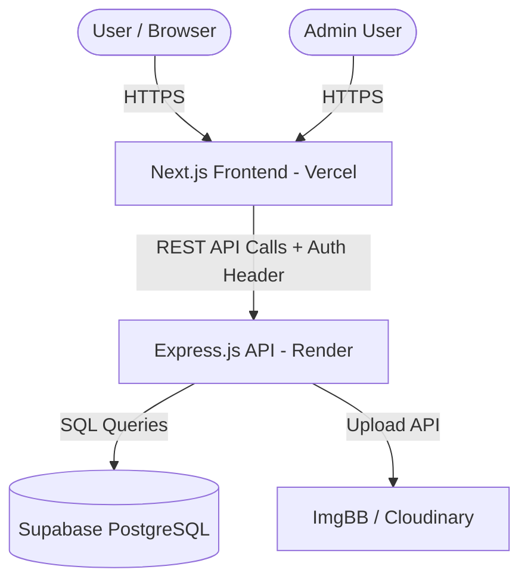

# AgeSense Initiative - Developer Handover Document (Takeover)

## 1. Project Overview
**AgeSense Initiative** is a platform managing public welfare programs, volunteer registrations, and donations. It uses a decoupled client-server architecture:
- **Frontend**: Next.js 16 (App Router), Tailwind CSS v4, TypeScript. Hosted on Vercel.
- **Backend**: Express.js, TypeScript, PostgreSQL (Supabase). Hosted on Render.
- **Asset Storage**: Cloudinary / ImgBB for uploaded images.

## 2. System Architecture

## 3. Directory Structure
- `/frontend`: Next.js web application.
- `/backend`: Express.js API.
- `/docs`: Architecture, database, and deployment documentation.
- `/deployment`: Configuration guides for Vercel, Render, Supabase, Cloudinary.
- `/graphify-out`: Knowledge graph and relationship mappings (Graphify).

## 4. Frontend Structure
- Framework: Next.js 16 App Router
- Styling: Tailwind CSS v4 ("Professional Compassion" theme in `globals.css`)
- Client: Native `fetch` wrapper in `api.ts`
- Routes: `/` (Home), `/admin` (Dashboard), `/donate`, `/volunteer`, `/programs`, etc.

## 5. Backend Structure
- Framework: Express.js (TypeScript)
- Validation: Zod
- Logging: Winston
- Database Driver: `pg` (node-postgres pool)

## 6. Database Schema and Migrations
The database is PostgreSQL hosted on **Supabase**. All tables use UUID primary keys.
- `users`: Admin logins (hashed passwords via SHA-256).
- `programs`: Public welfare programs (contains image links, target budgets).
- `volunteers`: Volunteer submissions with JSONB `form_data_json`.
- `donors`: Donation records.

### Migrations
Initial schemas are defined in `backend/src/database/migrations/01_init.sql`. The backend migrated from in-memory arrays to pg queries. 
An admin seeding script `backend/scripts/seed-admin.ts` exists to safely register the first admin.

## 7. Authentication, RBAC, and User Roles
- **JWT Session Authentication**: Access tokens signed using `JWT_SECRET`. Passed via the `Authorization` header.
- **Roles**: Currently utilizes an Admin role for access to the dashboard. Passwords hashed using SHA-256. 

## 8. API Endpoints
Key routes:
- `/api/health`, `/api/db-health`, `/api/cloudinary-health`
- Auth, Programs, Volunteers, Donors endpoints are protected via middleware checking the JWT.

## 9. File and Image Uploads
Images are handled externally (Cloudinary/ImgBB).
The backend does not store binaries in the DB; it saves the returned `image_url` string.

## 10. Environment Variables
Sensitive keys are NOT stored in the repo. Below are the required variables and where they go.
**Render Backend:**
- `NODE_ENV`, `PORT`, `FRONTEND_URL`, `ALLOWED_ORIGINS`, `DATABASE_URL`, `SUPABASE_URL`, `SUPABASE_SERVICE_ROLE_KEY`, `JWT_SECRET`, `ADMIN_EMAIL`, `ADMIN_PASSWORD`, `CLOUDINARY_CLOUD_NAME`, `CLOUDINARY_API_KEY`, `CLOUDINARY_API_SECRET`, `RENDER_EXTERNAL_URL`.

**Vercel Frontend:**
- `NEXT_PUBLIC_BACKEND_URL` (Points to Render URL).

## 11. Local Development Setup
1. Define env variables in `frontend/.env.local` and `backend/.env`.
2. Supabase local or remote DB required.
3. Backend: `npm install && npm run build && npm start` (or dev script).
4. Frontend: `npm install && npm run build && npm start` (or dev script).

## 12. Production Deployment
- **Frontend (Vercel)**: Next.js project linked to GitHub.
- **Backend (Render)**: Express Web Service. `npm install && npm run build` and `npm start`.
- **Database (Supabase)**: Hosted Postgres instance.

## 13. Production CORS Configuration and Recent "Failed to fetch" Issue
**Issue Context**: 
The frontend worked on `agesense.vercel.app` but failed on the custom domain `agesense.org` with browser "Failed to fetch" errors.

**Diagnosis**: 
The Render backend restricts requests using `FRONTEND_URL` and `ALLOWED_ORIGINS` for CORS. The production CORS origins were missing the custom domain. Browsers enforced CORS policy, rejecting responses.

**Fix**:
The `ALLOWED_ORIGINS` environment variable on Render must explicitly include every custom domain (e.g., `https://agesense.org,https://www.agesense.org,https://agesense.vercel.app`). `FRONTEND_URL` is also required. `RENDER_EXTERNAL_URL` must be set for the keep-alive job.

**Future Diagnostics**:
For "Failed to fetch" errors that only occur in the browser (and not in cURL/Postman):
1. Check the Browser Console (Network tab) for CORS preflight errors.
2. Verify all custom domains are listed in Render's `ALLOWED_ORIGINS`.

## 14. Graphify Usage
This project uses Graphify for codebase navigation.
- Knowledge graph located at `graphify-out/`.
- **Commands**: 
  - `graphify query "<question>"` for scoped context.
  - `graphify path "<A>" "<B>"` for relationships.
  - `graphify explain "<concept>"` for architecture focus.
  - `graphify update .` to keep AST updated after modifications.

## 15. Testing & Verification Status (Handover Check)
- **Frontend Build / Type-Check**: ✅ Passed (`next build` compiled successfully without type errors).
- **Backend Build / Type-Check**: ✅ Passed (`tsc` compiled successfully without type errors).
- **Graphify Status**: ✅ Updated.
- **Secret Scan**: ✅ Confirmed no raw credentials in documentation or committed source code files.
- **Documentation Consistency Check**: ✅ Reviewed architecture, deployment, and database documentation and aligned with current setup.
- **Remaining Gaps**: None. The current scope and architecture are fully documented.

## 16. Final Maintainer Notes
- Always test DB migrations locally before applying to Supabase.
- Always add new frontend domains to Render's `ALLOWED_ORIGINS`.
- Verify the keep-alive ping script (`node-cron`) works via `RENDER_EXTERNAL_URL`.
